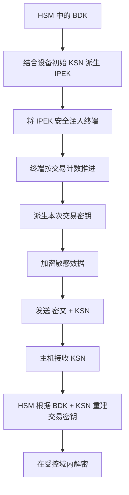
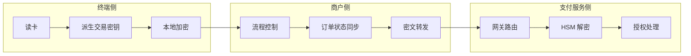
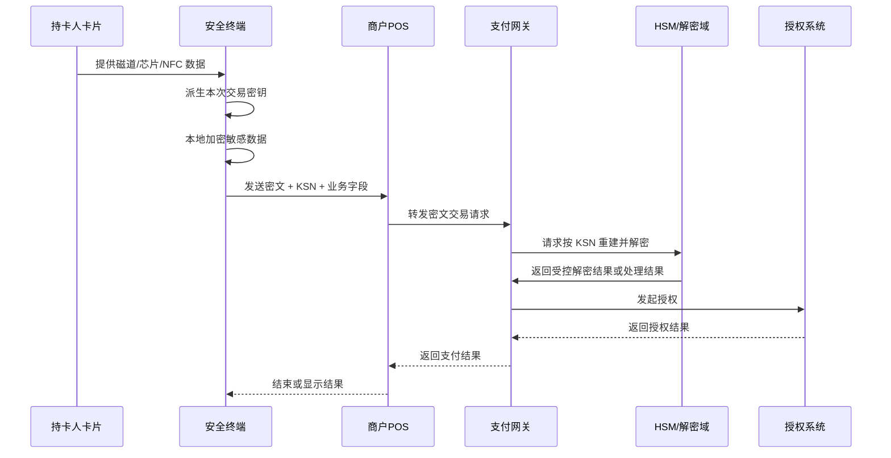
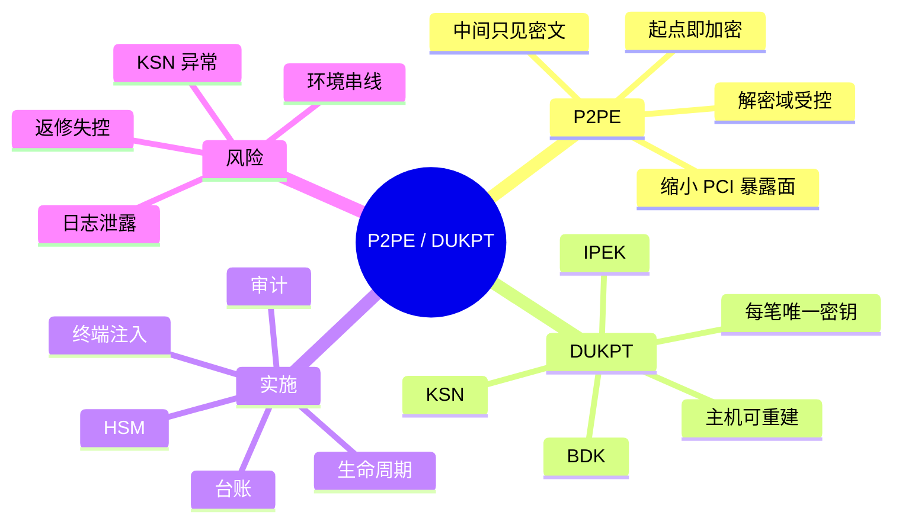

# 交易流程与图解

## 1. 为什么单独做一篇图解

P2PE 和 DUKPT 的理解难点，不是单个术语，而是多个对象同时运动时脑中容易打结。单独做图解的目的，是让你把下面三件事分开看清：

- 数据是怎么流的。
- 密钥是怎么准备和使用的。
- 哪些地方是信任边界，哪些地方只是转发层。

## 2. 一张图看懂 P2PE 交易链路

这张图里最关键的不是箭头，而是颜色含义：

- 绿色节点表示受控安全点。
- 灰色节点表示业务中间层，它们可以很重要，但不应该看到明文卡数据。

## 3. 一张图看懂 DUKPT 的准备与解密逻辑

这张图要记住两点：

- 终端和主机并不是共享“每笔交易的现成密钥表”。
- 它们是依靠相同规则和 KSN 各自推导出同一把工作密钥。

## 4. 一张图看懂职责边界

这张图体现的是：

- 商户侧并不是毫无价值，而是把价值放在业务控制与集成上。
- 支付安全方案的目标之一，就是把“看明文”的能力从商户侧剥离出去。

## 5. 一个没有 P2PE 的风险对照图

这张图想表达的是：

- 真正危险的不是“被窃听一次网络”，而是明文在多个普通系统里到处留下痕迹。

## 6. 一笔交易的详细时序示意

## 7. 场景案例一：门店 POS 被植入恶意软件

### 场景描述

攻击者控制了商户 POS 主机，具备：

- 读取进程内存的能力。
- 读取本地日志和缓存的能力。
- 抓本机网络包的能力。

### 如果没有良好 P2PE

攻击者可能拿到：

- 明文卡号。
- 磁道数据。
- 部分认证或辅助字段。

### 如果有良好 P2PE

攻击者大概率只能拿到：

- 密文载荷。
- KSN。
- 订单号、金额、时间戳等业务元数据。

### 这个案例的核心启示

P2PE 的价值不在于“门店电脑不会被攻破”，而在于“即使被攻破，攻击收益也显著下降”。

## 8. 场景案例二：注入流程出问题

### 场景描述

某批终端上线后，大量交易无法解密。

### 可能原因

- IPEK 注错了设备。
- KSN 台账与实际终端映射不一致。
- 测试注入材料误入生产。

### 启示

很多团队把注意力放在线上交易报文，却忽略了“出事前几周”的注入和配发流程。实际上一批设备级问题，往往根源不在线上而在生产准备阶段。

## 9. 场景案例三：终端返修后重新上线

### 场景描述

一台终端返修后重新部署，随后出现偶发解密失败。

### 可能原因

- 返修时清除了状态，但重新入网时台账没更新。
- 更换了主板或安全模块，设备身份与原 KSN 关系失效。
- 固件升级引入计数持久化问题。

### 启示

支付终端不是“换个设备继续用”这么简单。返修、翻新、替换都可能影响密钥状态和派生链。

## 10. 场景案例四：日志系统泄露

### 场景描述

技术团队为了排查问题，在网关层打印了完整终端请求报文。

### 风险差异

- 如果终端报文里是明文敏感数据，这几乎等于主动制造泄露面。
- 如果终端报文里主要是密文与 KSN，日志本身的风险等级会下降很多，但依然需要受控。

### 启示

P2PE 不是让日志可以随便打，而是让日志里更不容易出现致命级别的明文敏感数据。

## 11. 一张脑图式总结

## 12. 如何使用这些图

- 给新人培训时，先讲第 2、3、6 节。
- 做方案评审时，重点看第 4、7、8、9、10 节。
- 做系统排障时，结合第 6 节时序图和第 8、9 节案例一起看。

如果你后续还想继续扩展，这一篇最适合再往下加：

- 更多门店架构变种图。
- 更多“异常现场 -> 排障路径”的案例。
- 更多“合规角色 -> 职责边界”的图。