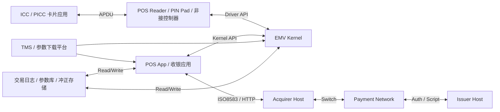
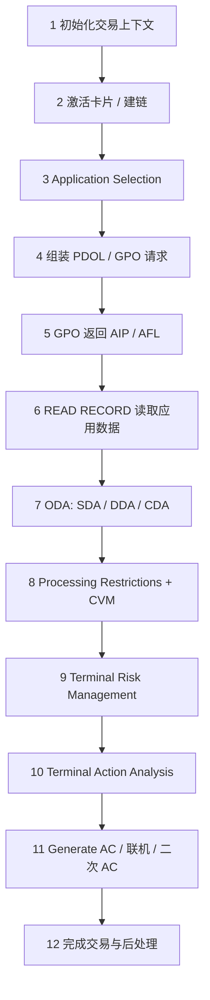
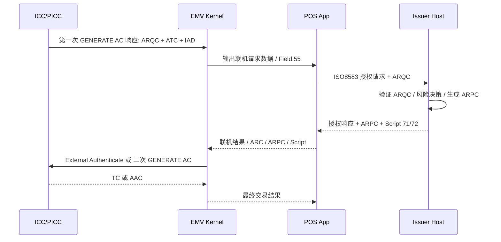
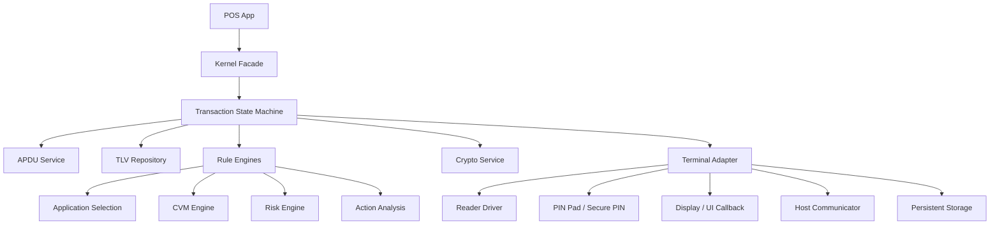
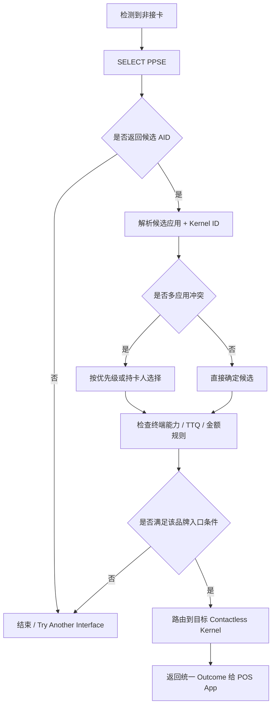
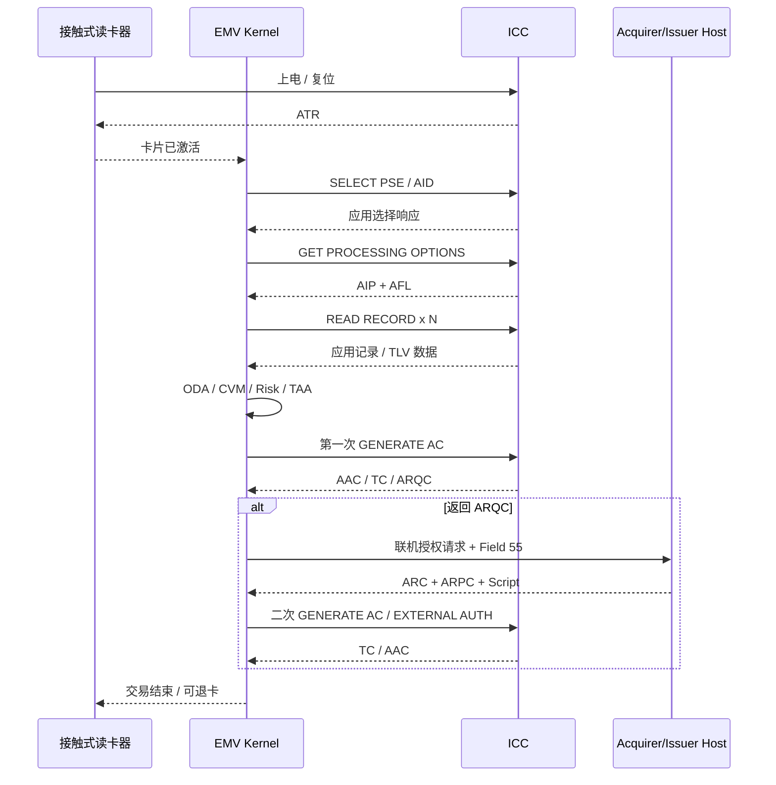
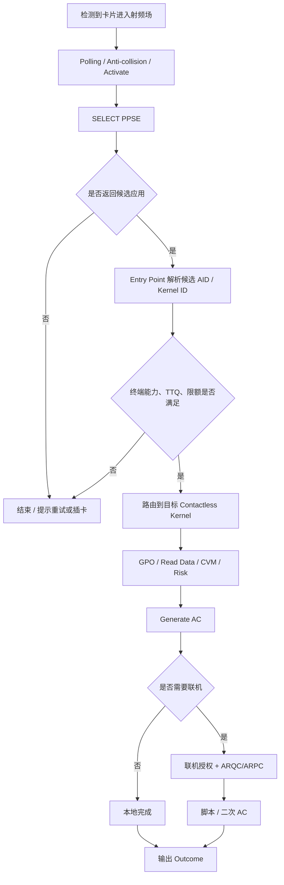
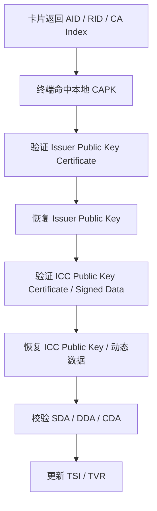

# EMV 内核工程指南

> 这份文档保留为“全量参考手册”。如果你希望按“参考书 + 工程实践指南”的方式使用整套材料，建议先从 [EMV-参考书索引.md](EMV-%E5%8F%82%E8%80%83%E4%B9%A6%E7%B4%A2%E5%BC%95.md) 进入；如果希望按循序渐进的方式学习，建议优先阅读分册学习路径：
>
> - [学习路径/00-EMV学习路线总览.md](学习路径/00-EMV学习路线总览.md)
> - [学习路径/01-EMV基础入门.md](学习路径/01-EMV基础入门.md)
> - [学习路径/02-交易流程与核心对象.md](学习路径/02-交易流程与核心对象.md)
> - [学习路径/03-密码学、联机与脚本.md](学习路径/03-密码学、联机与脚本.md)
> - [学习路径/04-内核架构与工程实践.md](学习路径/04-内核架构与工程实践.md)
> - [学习路径/05-调试、排错与测试.md](学习路径/05-调试、排错与测试.md)
> - [学习路径/06-真实交易日志逐行解读.md](学习路径/06-真实交易日志逐行解读.md)
> - [学习路径/07-品牌差异入门.md](学习路径/07-品牌差异入门.md)
> - [学习路径/08-Kernel L2测试与常见失败项.md](学习路径/08-Kernel%20L2%E6%B5%8B%E8%AF%95%E4%B8%8E%E5%B8%B8%E8%A7%81%E5%A4%B1%E8%B4%A5%E9%A1%B9.md)
> - [学习路径/09-参数与配置治理.md](学习路径/09-%E5%8F%82%E6%95%B0%E4%B8%8E%E9%85%8D%E7%BD%AE%E6%B2%BB%E7%90%86.md)
> - [学习路径/10-品牌差异对照版.md](学习路径/10-%E5%93%81%E7%89%8C%E5%B7%AE%E5%BC%82%E5%AF%B9%E7%85%A7%E7%89%88.md)
> - [学习路径/11-真实案例库.md](学习路径/11-%E7%9C%9F%E5%AE%9E%E6%A1%88%E4%BE%8B%E5%BA%93.md)
> - [学习路径/12-卡组织差异全景.md](学习路径/12-%E5%8D%A1%E7%BB%84%E7%BB%87%E5%B7%AE%E5%BC%82%E5%85%A8%E6%99%AF.md)
> - [学习路径/13-术语索引.md](学习路径/13-%E6%9C%AF%E8%AF%AD%E7%B4%A2%E5%BC%95.md)
> - [学习路径/14-EMV Tag索引.md](学习路径/14-EMV%20Tag%E7%B4%A2%E5%BC%95.md)
> - [学习路径/15-APDU索引.md](学习路径/15-APDU%E7%B4%A2%E5%BC%95.md)
> - [学习路径/16-位级速查附录.md](学习路径/16-%E4%BD%8D%E7%BA%A7%E9%80%9F%E6%9F%A5%E9%99%84%E5%BD%95.md)
> - [学习路径/17-AID RID CAPK参考表.md](学习路径/17-AID%20RID%20CAPK%E5%8F%82%E8%80%83%E8%A1%A8.md)
> - [学习路径/18-L3主机联调与交付专题.md](学习路径/18-L3%E4%B8%BB%E6%9C%BA%E8%81%94%E8%B0%83%E4%B8%8E%E4%BA%A4%E4%BB%98%E4%B8%93%E9%A2%98.md)
> - [学习路径/19-项目交付清单附录.md](学习路径/19-%E9%A1%B9%E7%9B%AE%E4%BA%A4%E4%BB%98%E6%B8%85%E5%8D%95%E9%99%84%E5%BD%95.md)
> - [学习路径/20-L3主机联调案例库.md](学习路径/20-L3%E4%B8%BB%E6%9C%BA%E8%81%94%E8%B0%83%E6%A1%88%E4%BE%8B%E5%BA%93.md)
> - [学习路径/21-SoftPOS mPOS SmartPOS专题.md](学习路径/21-SoftPOS%20mPOS%20SmartPOS%E4%B8%93%E9%A2%98.md)
> - [学习路径/22-非接触内核与Entry Point深化专题.md](学习路径/22-%E9%9D%9E%E6%8E%A5%E8%A7%A6%E5%86%85%E6%A0%B8%E4%B8%8EEntry%20Point%E6%B7%B1%E5%8C%96%E4%B8%93%E9%A2%98.md)
> - [学习路径/23-安全域、密钥与证书管理专题.md](学习路径/23-%E5%AE%89%E5%85%A8%E5%9F%9F%E3%80%81%E5%AF%86%E9%92%A5%E4%B8%8E%E8%AF%81%E4%B9%A6%E7%AE%A1%E7%90%86%E4%B8%93%E9%A2%98.md)
> - [学习路径/24-终端与主机报文字段全景对照.md](学习路径/24-%E7%BB%88%E7%AB%AF%E4%B8%8E%E4%B8%BB%E6%9C%BA%E6%8A%A5%E6%96%87%E5%AD%97%E6%AE%B5%E5%85%A8%E6%99%AF%E5%AF%B9%E7%85%A7.md)
> - [学习路径/25-认证资料、测试包与实验室送测专题.md](学习路径/25-%E8%AE%A4%E8%AF%81%E8%B5%84%E6%96%99%E3%80%81%E6%B5%8B%E8%AF%95%E5%8C%85%E4%B8%8E%E5%AE%9E%E9%AA%8C%E5%AE%A4%E9%80%81%E6%B5%8B%E4%B8%93%E9%A2%98.md)

## 1. 文档目标

本文面向 EMV POS / mPOS / SoftPOS / SmartPOS 内核工程师，重点从“工程实现”和“交易控制”的角度解释 EMV 内核的核心机制，而不是只罗列规范术语。内容覆盖：

- EMV 系统整体架构
- EMV 交易生命周期（12 步完整流程）
- Application Selection 的设计目的
- GPO（AIP / AFL）
- Offline Authentication（SDA / DDA / CDA）
- CVM 持卡人验证机制
- Terminal Risk Management
- Terminal Action Analysis（TVR / TAC / IAC）
- Generate AC 交易核心
- ARQC / ARPC 密码学流程
- ISO8583 Field 55 / EMV TLV
- Issuer Script（71 / 72）
- POS Kernel 软件架构
- Contactless Entry Point 路由
- 常见 EMV Kernel 开发问题

> 说明：不同卡组织（Visa、Mastercard、Amex、JCB、UnionPay、Discover 等）会在 EMV 基础流程上引入品牌特定规则；本文优先介绍“EMV 通用骨架”，并在必要处补充品牌差异意识。

---

## 2. EMV 系统整体架构

EMV 系统不是单一软件模块，而是由“卡片、终端、受理网络、发卡行”共同完成的分布式交易系统。

### 2.1 参与方

1. **ICC / PICC（芯片卡 / 非接卡）**  
   存储应用、密钥、风险参数和交易状态；对外通过 APDU 与终端交互。

2. **Reader / Terminal（终端设备）**  
   包括接触式读卡器、非接天线、PIN Pad、键盘、显示器、打印机、SAM/HSM 接口、网络模块。

3. **POS Kernel（EMV 内核）**  
   终端中的核心协议引擎，负责 APDU 编排、TLV 解析、风险控制、CVM 选择、脚本执行、AC 流程控制。

4. **Terminal Application / POS App（收银应用）**  
   负责金额输入、商品信息、界面流程、交易类型、联机通信、冲正、签购单、批结算等业务逻辑。

5. **Acquirer Host（收单主机）**  
   接收终端联机授权请求，透传或转换 EMV 数据至支付网络。

6. **Payment Network / Switch（卡组织网络）**  
   负责消息转发、风险规则、品牌字段要求、脚本和 ARPC 回传。

7. **Issuer Host（发卡主机）**  
   验证 ARQC、计算 ARPC、做账户与风险决策、生成授权结果与脚本。

### 2.2 分层视角

从工程实现上，可把 EMV 系统分为 5 层：

1. **硬件访问层**  
   封装读卡器、非接控制器、PIN Pad、安全模块、网络设备。

2. **协议传输层**  
   管理 APDU 收发、T=0/T=1、ISO 14443、时序、重试、超时。

3. **EMV 内核层**  
   负责交易状态机、对象管理、风险控制、数据认证、CVM、AC 流程。

4. **终端业务层**  
   管理金额、票据号、批次号、交易类型、联机授权、冲正、电子签名、日志。

5. **平台接入层**  
   连接 ISO8583、HTTP、消息队列、TMS、远程参数下载和监控平台。

### 2.3 核心数据流

典型数据流如下：

1. 终端从卡中读取应用和数据对象。
2. 内核基于终端参数与卡片能力做风险与路径决策。
3. 若需联机，终端生成含 EMV TLV 的授权请求。
4. 发卡行返回授权响应、ARPC、Issuer Script。
5. 终端再次与卡片交互，完成 TC / AAC / 在线完成。

### 2.4 工程上最重要的三个对象域

1. **Card Data**：卡片返回的静态 / 动态 TLV 数据。  
2. **Terminal Data**：终端参数、能力、国家码、货币码、风险阈值、 TAC。  
3. **Transaction Context**：金额、交易类型、时间、随机数、CVM 结果、TVR、TSI、AC 结果。  

EMV 内核的本质，就是围绕这三类对象不断做“读取、计算、决策、组包、回写”。

### 2.5 系统架构图（逻辑视角）



### 2.6 典型职责边界表

| 层级 / 组件 | 核心职责 | 不建议承担的职责 |
| --- | --- | --- |
| Reader Driver | 建链、上电、收发 APDU、超时控制 | 交易规则、品牌逻辑 |
| EMV Kernel | 状态机、TLV 管理、CVM、风险、AC、脚本 | UI 细节、清算、批结算 |
| POS App | 金额采集、界面、联机通信、冲正、打印 | 直接解析卡片 APDU 细节 |
| Host Adapter | ISO8583 映射、报文字段适配、重发策略 | 改写内核决策 |
| TMS / Config | AID、CAPK、TAC、Floor Limit、品牌参数 | 即时交易态计算 |

---

## 3. EMV 交易生命周期（12 步完整流程）

下面给出一个工程上最常用的“12 步完整流程”。不同品牌或非接流程可能压缩、跳过或合并部分步骤，但总体框架一致。

### Step 1：交易初始化

终端应用创建交易上下文，确定：

- 交易类型（消费、撤销、预授权、余额查询等）
- 金额、其他金额、币种、国家码
- 终端能力、附加终端能力、终端类型
- 交易日期、时间、UN、流水号
- 接触 / 非接模式

**工程重点：**

- 交易上下文必须是一次交易独立实例，禁止复用脏状态。
- 金额、币种、国家码必须在进入 GPO 前准备好，因为很多品牌要求 CDOL1 相关字段可用。

### Step 2：卡片激活与 ATR / ATS 建链

- 接触式：上电、复位、读取 ATR，协商协议参数。
- 非接式：REQA / WUPA、抗冲突、激活、RATS、ATS。

**工程重点：**

- 驱动层应屏蔽物理细节，把“可发送 APDU 的逻辑链路”统一暴露给内核。
- 非接超时、场强波动、重复激活是高频异常点。

### Step 3：Application Selection

终端根据 AID 列表选择要运行的支付应用。

- PSE / PPSE 路径
- 直接 AID 路径
- 部分匹配 / 完全匹配
- 品牌优先级与持卡人选择

**输出：**最终 AID、应用标签、优先级、应用选择结果。

### Step 4：Initiate Application Processing（GPO 前准备）

终端收集 PDOL 所需数据，拼装 `GET PROCESSING OPTIONS` 命令。

- 读取 PDOL（若存在）
- 填充终端数据对象
- 对不存在的数据按规范补零或默认值

**工程重点：**

- PDOL 缺字段是内核兼容性问题高发区。
- 所有数据长度必须严格按 DOL 定义编码，而不是按自然长度。

### Step 5：GPO（获取 AIP / AFL）

卡片返回：

- **AIP（Application Interchange Profile）**：应用能力位图
- **AFL（Application File Locator）**：后续要读哪些记录

这一步决定“后续要读什么”和“卡支持什么能力”。

### Step 6：Read Application Data

终端依据 AFL 逐条读取记录（`READ RECORD`），提取：

- PAN、有效期、卡序列号
- CA 公钥索引
- SDA / DDA / CDA 相关对象
- CVM List
- CDOL1 / CDOL2
- Issuer Action Codes
- 其他品牌特定对象

**工程重点：**

- 读取结果要进入统一 TLV 数据仓库，而不是散落在多个局部变量里。
- 必须区分“卡上不存在”与“读卡失败”这两类错误。

### Step 7：Offline Data Authentication

根据 AIP 与读到的数据执行：

- SDA
- DDA
- CDA

如果认证失败，通常会在 TVR 中置位，随后影响终端动作分析。

### Step 8：Processing Restrictions + Cardholder Verification

通常这一阶段包含两类决策：

1. **处理限制**  
   - 应用版本检查
   - 有效期检查
   - 使用控制检查（AUC）
   - 服务限制检查

2. **持卡人验证（CVM）**  
   - Offline PIN
   - Online PIN
   - Signature
   - No CVM

### Step 9：Terminal Risk Management

终端基于本地风险参数做离线/联机倾向判断，包括：

- Floor Limit 检查
- Random Selection
- Velocity Checking
- Exception File Checking

输出体现在 TVR / TSI 中。

### Step 10：Terminal Action Analysis

终端综合以下信息决定下一步：

- TVR
- TAC（Denial / Online / Default）
- IAC（Denial / Online / Default）
- 交易类型与品牌规则

可能得到三类倾向：

- 直接拒绝
- 必须联机
- 可以离线批准/拒绝

### Step 11：Generate AC / 联机授权 / 二次 Generate AC

这是交易核心阶段：

1. 终端组织 CDOL1 数据，发起第一次 `GENERATE AC`
2. 卡返回：AAC / TC / ARQC
3. 若返回 ARQC，则终端发起联机授权
4. 主机返回授权码、ARPC、Issuer Script
5. 终端执行 External Authenticate（若品牌要求）或直接进行二次 `GENERATE AC`
6. 卡最终输出 TC 或 AAC

### Step 12：完成交易与后处理

- 更新 TSI / TVR / CVM Result
- 保存脚本结果、授权码、ARC
- 打印签购单或电子回执
- 保存日志、冲正信息、清算数据
- 释放读卡器资源

**工程重点：**

- 交易结束不是 UI 结束，而是“状态持久化完成、异常恢复点明确”后才算真正结束。
- 掉电恢复和二次冲正要在系统级设计中考虑，而不是事后补丁。

### 3.1 12 步交易流程图



### 3.2 12 步流程的输入 / 输出视角

| 阶段 | 关键输入 | 关键输出 |
| --- | --- | --- |
| 1~3 | 金额、终端能力、AID 列表、卡响应 | 最终应用、接口类型、交易上下文 |
| 4~6 | PDOL、AFL、APDU 响应 | AIP、AFL、应用数据 TLV 仓库 |
| 7~10 | ODA 数据、CVM List、终端风险参数、TVR | TVR、TSI、CVM Results、动作倾向 |
| 11 | CDOL1/CDOL2、联机响应、脚本 | AAC / TC / ARQC、ARPC 处理结果、脚本结果 |
| 12 | 最终 Outcome、日志、授权码 | 凭条、冲正信息、交易持久化记录 |

---

## 4. Application Selection 设计目的

Application Selection 不只是“找一个 AID”这么简单，它的设计目的是在多应用、多品牌、多接口环境中，确定一次交易到底由哪个支付应用来接管。

### 4.1 为什么需要 Application Selection

一张卡可能同时包含：

- 借记应用
- 贷记应用
- 本地品牌应用
- 国际品牌应用
- 接触式应用与非接式应用

终端必须在这些应用中找到“同时被终端支持、也被卡支持、并满足优先级规则”的那个应用。

### 4.2 它解决的核心问题

1. **终端和卡片能力匹配**  
   终端只支持部分 AID；卡也只暴露部分 ADF。

2. **多应用冲突消解**  
   一张卡多个应用都可用时，需要决定优先顺序，或让持卡人选择。

3. **品牌路由统一入口**  
   后续 GPO、CVM、风险参数、联机字段规则都依赖于最终应用。

4. **交易体验一致性**  
   让终端在接触 / 非接模式下都走统一的选择逻辑。

### 4.3 常见选择路径

#### 1）PSE / PPSE 目录选择

- 接触式常见 `1PAY.SYS.DDF01`
- 非接式常见 `2PAY.SYS.DDF01`

终端先选目录，再取目录中列出的候选应用。

#### 2）直接 AID 枚举

如果 PSE / PPSE 不可用，终端直接用本地 AID 列表逐个 `SELECT`。

### 4.4 工程设计建议

- 把“候选应用发现”和“候选应用决策”分成两个阶段。
- 候选结果中至少保留：AID、Label、Preferred Name、Priority、Kernel ID、Interface Type。
- 为接触和非接分别设计“发现器”，但共享“决策器”。
- 永远记录选择日志；Application Selection 问题极难靠表面现象定位。

---

## 5. GPO（AIP / AFL）

`GET PROCESSING OPTIONS` 是 EMV 交易从“选中应用”进入“执行交易”的起点。

### 5.1 GPO 的作用

GPO 主要回答两个问题：

1. **这张卡当前应用支持哪些 EMV 能力？** → AIP  
2. **终端接下来该读取哪些记录？** → AFL  

### 5.2 PDOL 的作用

卡片通过 PDOL 告诉终端：“为了开始处理，你需要先给我这些终端数据。”

常见 PDOL 项包括：

- 9F66 TTQ（非接常见）
- 9F02 Amount, Authorised
- 9F03 Amount, Other
- 9F1A Terminal Country Code
- 95 TVR
- 5F2A Transaction Currency Code
- 9A Transaction Date
- 9C Transaction Type
- 9F37 Unpredictable Number

### 5.3 AIP（82）

AIP 是应用能力位图，常见含义包括：

- 是否支持 SDA
- 是否支持 DDA
- 是否支持持卡人验证
- 是否支持终端风险管理
- 是否支持发卡行认证
- 是否支持 CDA

**工程意义：**

AIP 不是“建议”，而是后续流程分支条件：

- AIP 不支持 Offline Authentication，就不能强行做 DDA/CDA。
- AIP 不支持 CVM，就不能在内核里走正常 CVM 列表决策。
- AIP 不支持 Issuer Authentication，则 ARPC 处理路径要谨慎。

### 5.4 AFL（94）

AFL 用于指导终端读记录，通常每 4 字节为一组：

- SFI
- 起始记录号
- 结束记录号
- 需要参与离线认证的记录数

**工程意义：**

- AFL 是终端读卡计划表。
- 内核不应假设某标签一定在哪条记录里，而应按 AFL 读取、再解析。
- 离线认证数据拼接顺序往往依赖 AFL 指示，不能乱序。

### 5.5 GPO 实现常见问题

- PDOL 长度不匹配导致 `6985` / `6A80`
- 误把数值按十进制文本填入二进制字段
- 非接场景遗漏 TTQ / 专有数据对象
- 对 Format 1 / Format 2 响应兼容不充分

---

## 6. Offline Authentication（SDA / DDA / CDA）

Offline Authentication 的目标是：**让终端在不联机的情况下，对卡片数据的真实性做一定程度验证。**

### 6.1 SDA（Static Data Authentication）

#### 原理

发卡行将“静态应用数据”的签名写入卡中，终端使用 CA 公钥链验证签名，确认卡内静态数据未被篡改。

#### 优点

- 实现相对简单
- 对终端和卡的计算能力要求较低

#### 缺点

- 只能验证静态数据
- 不能防止卡片复制（clone）

#### 工程结论

SDA 主要防篡改，不防克隆；安全级别最低。

### 6.2 DDA（Dynamic Data Authentication）

#### 原理

卡片持有动态密钥能力，终端发送随机挑战，卡片返回动态签名，终端验证该签名。

#### 优势

- 能证明“卡片具备私钥”，比 SDA 更能防复制

#### 工程关键点

- 终端必须正确处理 ICC 公钥恢复链
- 随机数必须高质量
- 认证失败要准确映射到 TVR

### 6.3 CDA（Combined DDA/Application Cryptogram）

#### 原理

CDA 把“动态认证”和“应用密码生成”结合在一起，通常发生在 `GENERATE AC` 响应中。

#### 优势

- 把交易相关数据纳入认证范围
- 抗中间人和重放能力更强
- 是更现代的离线认证方式

### 6.4 公钥链概念

离线认证一般涉及以下链路：

1. CA Public Key
2. Issuer Public Key
3. ICC Public Key
4. Signed Static / Dynamic Application Data

### 6.5 工程实现建议

- 把 RSA 恢复、哈希验证、证书解析做成独立密码模块。
- 不要把品牌逻辑和 RSA 解析逻辑混在一起。
- 对每一步失败原因细分日志：证书格式错、索引不存在、哈希不匹配、长度不符、恢复失败。
- 内核需要输出“认证失败类型”，不仅是布尔值。

### 6.6 常见失败原因

- CA 公钥表缺失或版本过期
- Issuer Public Key Certificate 解析错误
- PAN / RID / Index 关联错
- 参与认证的数据顺序不对
- CDA 响应解析到错误模板

---

## 7. CVM 持卡人验证机制

CVM（Cardholder Verification Method）用于确认“拿卡的人是否被允许使用这张卡”。

### 7.1 常见 CVM 类型

- Offline Plaintext PIN
- Offline Enciphered PIN
- Online PIN
- Signature
- No CVM Required
- Fail CVM Processing

### 7.2 CVM List 的作用

卡片通过 CVM List 告诉终端：

- 支持哪些验证方式
- 不同金额 / 条件下优先用哪种方式
- 某种方式失败后是否继续下一种方式

### 7.3 CVM 决策输入

CVM 选择不只是看卡片列表，还要结合：

- 终端能力（是否支持 PIN Pad、联机 PIN、签名）
- AIP / 品牌要求
- 交易金额
- 货币 / 国家条件
- 非接小额免密规则

### 7.4 工程实现建议

- 把 CVM 逻辑实现成“规则匹配器 + 执行器”。
- 执行结果至少区分：成功、失败、不可执行、用户取消、超时、绕过。
- PIN 输入设备结果和内核结果要分层，避免耦合 UI。
- 统一生成 `9F34 CVM Results`。

### 7.5 Offline PIN 与 Online PIN 的区别

#### Offline PIN

- PIN 由卡片验证
- 终端通过 `VERIFY` 命令与卡片交互
- 无需联机即可完成

#### Online PIN

- PIN 发往主机验证
- 终端需调用安全键盘 / PIN Pad 做加密 PIN Block
- 与联机授权流程结合

### 7.6 常见工程坑

- PIN bypass 场景处理不当
- CVM 条件码解释错误
- 非接交易把 No CVM 错误当作默认通过
- Offline PIN 重试次数、锁卡状态处理不规范

---

## 8. Terminal Risk Management

Terminal Risk Management 的作用是：**在终端本地先做一轮风险判断，减少不必要的离线批准，提升欺诈拦截能力。**

### 8.1 核心机制

#### 1）Floor Limit Checking

如果交易金额超过终端 floor limit，终端倾向联机。

#### 2）Random Transaction Selection

即使金额未超限，也按一定随机比例抽样联机。

#### 3）Velocity Checking

基于卡片离线累计计数器、最近交易次数、金额累计等判断风险。

#### 4）Exception File Checking

检查 PAN / 序列号是否在本地黑名单或异常名单中。

### 8.2 风险管理输出

风险管理本身并不直接决定批准或拒绝，而是通过：

- 设置 TVR bit
- 更新 TSI
- 影响 Terminal Action Analysis

### 8.3 工程实现建议

- 风险参数应支持 TMS 动态下载。
- Floor Limit、随机比例、异常文件策略应支持品牌/商户/终端维度配置。
- 随机数源不能偷懒使用低质量时间戳截断。
- Velocity 需要和交易日志 / 持久化存储打通。

### 8.4 常见误区

- 把风险管理写成“一刀切联机”逻辑，失去 EMV 设计价值。
- 忽略离线累计相关对象，导致卡片风险能力没有被利用。
- 参数粒度太粗，无法适配不同品牌和商户场景。

---

## 9. Terminal Action Analysis（TVR / TAC / IAC）

Terminal Action Analysis 是 EMV 决策中最容易“表面会用、底层不透”的部分。它的本质是：**把交易过程中发现的异常，映射为终端动作决策。**

### 9.1 TVR（Terminal Verification Results）

TVR 是 5 字节位图，用来记录终端在交易过程中发现的问题，例如：

- 离线数据认证未执行 / 失败
- 卡片和终端应用版本不一致
- 卡片已过期 / 尚未生效
- 需要联机 PIN 但终端做不了
- 交易超过 floor limit
- 随机选择为联机
- 脚本执行失败

**关键认识：**

TVR 是“事实记录”，不是“最终结论”。

### 9.2 TAC（Terminal Action Codes）

TAC 是终端侧参数，通常分三组：

- TAC-Denial
- TAC-Online
- TAC-Default

含义分别是：

- 出现这些问题时直接拒绝
- 出现这些问题时尽量联机
- 联机不可达或默认情况下按这些问题决定结果

### 9.3 IAC（Issuer Action Codes）

IAC 来自卡片，一般也分三组：

- IAC-Denial
- IAC-Online
- IAC-Default

它代表发卡行对风险项的偏好策略。

### 9.4 决策思想

终端通常会做如下比较：

1. `TVR & (TAC-Denial | IAC-Denial)` 非 0 → 倾向拒绝  
2. `TVR & (TAC-Online | IAC-Online)` 非 0 → 倾向联机  
3. 如果不能联机，再看 `TVR & (TAC-Default | IAC-Default)`  

### 9.5 工程实现建议

- 不要把 TVR/TAC/IAC 写死在分散的 `if` 里，应该抽象成位图运算层。
- 输出决策日志时必须展示：哪个 TVR bit 命中了哪个 TAC/IAC。
- 为品牌定制保留扩展点，因为不同 scheme 对某些 bit 的使用细节不完全一致。

### 9.6 开发调试的关键经验

绝大多数“为什么这笔交易走联机/被拒绝”的问题，最后都要回到：

- 哪些 TVR bit 被置位？
- 是哪条规则置位的？
- 命中了哪个 TAC / IAC？
- 当前是否允许联机？

---

## 10. Generate AC 交易核心

`GENERATE AC` 是 EMV 交易的核心命令，几乎可以认为是“卡片对本次交易做出密码学态度表态”的接口。

### 10.1 AC 的几种类型

卡片可返回：

- **AAC**：Application Authentication Cryptogram，拒绝
- **TC**：Transaction Certificate，离线批准 / 完成
- **ARQC**：Authorization Request Cryptogram，请求联机授权

### 10.2 第一次 Generate AC

终端将 CDOL1 所需数据送给卡片，卡片基于：

- 交易金额
- 终端风险信息
- CVM 结果
- TVR / TSI
- 卡内限制与计数器

生成 AAC / TC / ARQC。

### 10.3 第二次 Generate AC

若第一次返回 ARQC，联机后终端通常还需发第二次 `GENERATE AC`，把：

- ARC / 授权响应码
- Issuer Authentication Data
- Issuer Script Result 等

带给卡片，让卡片最终决定输出 TC 或 AAC。

### 10.4 为什么它是交易核心

因为它是卡片把“读卡数据阶段”转化为“交易决策阶段”的分水岭：

- 前面更多是在收集信息
- 从 Generate AC 开始，卡片正式给出批准/拒绝/联机意图

### 10.5 工程实现要点

- CDOL1 / CDOL2 构造器必须独立封装。
- 不同 AC 类型的响应模板解析要健壮。
- 应记录 CID、ATC、AC、IAD、Issuer Application Data 关键对象。
- 一次和二次 Generate AC 的上下文必须严格关联，不能丢失中间状态。

### 10.6 高频问题

- CDOL 数据长度错误
- 未正确设置 TVR / TSI 导致卡侧决策异常
- 二次 Generate AC 缺失 ARC/IAD
- 错误解析 CID，误判 AAC/TC/ARQC

---

## 11. ARQC / ARPC 密码学流程

这是 EMV 联机交易的密码学主链路。

### 11.1 ARQC 是什么

ARQC（Authorization Request Cryptogram）是卡片生成的联机授权请求密码。

其作用：

- 让发卡行确认这笔请求来自合法卡片
- 让发卡行确认关键交易数据未被篡改
- 将卡片状态（ATC、CVR、IAD 等）带入主机风控

### 11.2 ARQC 输入的典型组成

具体算法和字段会因品牌不同而有所差异，但典型会包含：

- Amount
- Terminal Country Code
- TVR
- Transaction Currency Code
- Transaction Date
- Transaction Type
- UN
- AIP
- ATC
- CVR / IAD 中的风险状态信息

### 11.3 发卡行如何验证 ARQC

发卡行拿到卡号、序列号、ATC、UN、金额等数据后：

1. 找到该卡对应的会话密钥 / 主密钥
2. 使用同样算法重算 ARQC
3. 与终端上传值比对
4. 结合账户状态和风控规则决定批准或拒绝

### 11.4 ARPC 是什么

ARPC（Authorization Response Cryptogram）是发卡行对 ARQC 的回应，用于让卡片确认：

- 这次联机响应确实来自合法发卡方
- 发卡方对这笔交易的决策是可信的

### 11.5 ARQC / ARPC 的闭环

1. 卡片生成 ARQC  
2. 终端上送主机  
3. 发卡行验证 ARQC  
4. 发卡行生成 ARPC  
5. 终端把 ARPC 带回卡片  
6. 卡片验证 ARPC 后完成二次决策  

### 11.5.1 ARQC / ARPC 时序图



### 11.5.2 密码学闭环中的责任边界

| 角色 | 主要职责 | 常见排错点 |
| --- | --- | --- |
| 卡片 | 生成 ARQC、验证 ARPC、更新 ATC/状态 | ATC 异常、IAD 结构差异、二次 AC 结果异常 |
| 终端内核 | 收集输入标签、构造联机数据、消费主机响应 | Field 55 漏标签、UN 弱随机、ARC 传递错误 |
| 主机 | 验证 ARQC、做风控、生成 ARPC/脚本 | 密钥版本错误、CVN 识别错误、脚本时机错误 |

### 11.6 工程实现建议

- 把“EMV 数据采集”和“联机报文映射”分离。
- 不同品牌的 IAD、CVR、CVN 解析逻辑不要共用同一套硬编码实现。
- 主机字段缺失、字段格式错误，常常表现为“ARQC 验证失败”。
- 必须记录 ARQC 请求前后的关键标签，便于与主机联合排查。

### 11.7 安全注意事项

- UN 必须不可预测，不能是流水号拼接时间戳。
- 密钥派生逻辑必须严格按品牌规范实现。
- 终端日志中应避免泄露敏感密钥材料与 PIN 数据。

---

## 12. ISO8583 Field 55 / EMV TLV

联机交易中，EMV 数据通常通过 ISO8583 的 Field 55 传输。

### 12.1 什么是 Field 55

Field 55 是一个承载 EMV TLV 数据的字段，通常用于把卡片和终端的关键 EMV 标签打包上送给主机。

### 12.2 为什么不用平铺字段

因为 EMV 数据天然是 TLV 结构：

- 标签种类多
- 品牌差异大
- 可选字段多
- 扩展能力强

Field 55 的 TLV 编码非常适合承载这类复杂、可扩展的芯片交易数据。

### 12.3 常见上送标签

常见但不限于：

- 82 AIP
- 84 DF Name
- 95 TVR
- 9A Transaction Date
- 9C Transaction Type
- 5F2A Transaction Currency Code
- 9F02 Amount, Authorised
- 9F03 Amount, Other
- 9F10 Issuer Application Data
- 9F1A Terminal Country Code
- 9F26 Application Cryptogram
- 9F27 CID
- 9F36 ATC
- 9F37 UN
- 9F34 CVM Results
- 9F33 Terminal Capabilities
- 9F35 Terminal Type
- 9F41 Transaction Sequence Counter

### 12.4 TLV 编码工程要点

- Tag 可能是 1~3 字节甚至更长，不能假设 1 字节。
- Length 可能是短格式或长格式。
- Value 可能是 primitive，也可能是模板嵌套。
- 同一标签的编码长度必须与规范一致。

### 12.5 Field 55 封装建议

- 使用统一 TLV 库完成编码与解码。
- 按主机 / 品牌规范选择字段顺序和是否上送。
- 为每个标签记录来源：卡片、终端计算、主机回填。
- 保证 BCD / Binary / Numeric / Compressed Numeric 编码不混淆。

### 12.6 常见问题

- Tag 顺序与主机约定不一致
- 把十六进制字符串当作 ASCII 发送
- 长度字段编码错误
- 漏传主机必需标签，导致 ARQC 验证失败或主机拒绝

### 12.7 常见 Field 55 标签速查表

| Tag | 名称 | 常见来源 | 典型用途 |
| --- | --- | --- | --- |
| 82 | AIP | 卡片 GPO | 决定 ODA/CVM/Issuer Auth 能力 |
| 84 | DF Name | 应用选择 | 标识最终应用 |
| 95 | TVR | 终端计算 | 主机理解终端发现的风险事实 |
| 9F10 | IAD | 卡片 | 主机识别 CVR/CVN/卡侧风险状态 |
| 9F26 | Application Cryptogram | 卡片 | ARQC / TC / AAC 密码值 |
| 9F27 | CID | 卡片 | 标识 AAC / TC / ARQC 类型 |
| 9F36 | ATC | 卡片 | 交易计数器，参与密钥和风控 |
| 9F37 | UN | 终端 | 防重放、参与 ARQC 输入 |
| 9F34 | CVM Results | 终端 | 上送持卡人验证结果 |
| 9F33 | Terminal Capabilities | 终端 | 表示终端支持能力 |

### 12.8 TLV 解析与封装建议接口

建议在内核中固定一组基础能力接口：

- `parseTlv(bytes) -> TlvTree`
- `encodeTlv(tag, value) -> bytes`
- `findTag(tree, tag) -> value`
- `mergeTagSet(card, terminal, computed) -> transactionView`
- `buildField55(tagList) -> bytes`

这样做的价值在于：统一 TLV 能力后，Field 55、脚本模板、GPO 响应、记录解析都能复用同一套底层实现。

---

## 13. Issuer Script（71 / 72）

Issuer Script 是发卡行通过联机响应下发给卡片的“远程命令”。

### 13.1 作用

常见用途包括：

- 修改卡片参数
- 同步风险状态
- 锁定应用
- 更新离线计数器或限制
- 触发特定管理动作

### 13.2 71 / 72 的区别

工程上通常理解为：

- **71**：在第二次 `GENERATE AC` 前执行的脚本模板
- **72**：在第二次 `GENERATE AC` 后执行的脚本模板

具体品牌和实现细节可能有差异，但“前脚本 / 后脚本”的理解非常关键。

### 13.3 处理流程

1. 主机返回脚本模板和相关认证数据
2. 终端解析 71 / 72 模板
3. 按顺序向卡片发送脚本 APDU
4. 收集每条脚本执行结果
5. 将脚本结果写入脚本结果标签，影响后续 TVR/日志/上送

### 13.4 工程实现建议

- 把脚本执行器设计成独立模块，避免混在联机代码里。
- 必须保证脚本顺序执行，不能并发。
- 每条脚本都要记录 APDU、SW1SW2、结果码。
- 脚本失败通常不应导致终端崩溃，但要正确置位 TVR 并留痕。

### 13.5 常见问题

- 脚本模板解析错误
- 71/72 执行时机颠倒
- 脚本失败未上报
- 联机批准后因为脚本错误导致卡片最终 AAC，被误判为主机拒绝

---

## 14. POS Kernel 软件架构

从软件设计角度，一个可维护的 POS Kernel 不应写成“巨型流程函数”，而应采用分层和状态机架构。

### 14.1 推荐模块划分

#### 1）Kernel Facade

对上层暴露统一接口，例如：

- `startTransaction()`
- `processCard()`
- `continueOnlineResult()`
- `cancelTransaction()`
- `getOutcome()`

#### 2）Transaction State Machine

负责状态推进，例如：

- INIT
- CARD_ACTIVATED
- APP_SELECTED
- GPO_DONE
- RECORDS_READ
- ODA_DONE
- CVM_DONE
- RISK_DONE
- FIRST_AC_DONE
- ONLINE_DONE
- SECOND_AC_DONE
- COMPLETED / TERMINATED

#### 3）APDU Service

统一封装：

- `SELECT`
- `GPO`
- `READ RECORD`
- `VERIFY`
- `GENERATE AC`
- `EXTERNAL AUTHENTICATE`
- 脚本 APDU

#### 4）TLV Repository

统一存放整个交易过程中的标签对象：

- card TLV
- terminal TLV
- computed TLV
- host TLV

#### 5）Rule Engines

包括：

- Application Selection Engine
- CVM Engine
- Risk Management Engine
- Action Analysis Engine

#### 6）Crypto Service

负责：

- ODA 验签
- ARQC/ARPC 相关数据处理
- 随机数
- 安全硬件调用

#### 7）Terminal Adapter

适配设备能力：

- Reader
- Contactless controller
- PIN Pad
- Display/UI callback
- Host communicator
- Persistent storage

### 14.2 推荐设计原则

- **状态机驱动，不要靠布尔变量拼流程。**
- **数据中心化，不要到处传散落参数。**
- **品牌规则插件化，不要在公共代码里堆满 `if scheme == ...`。**
- **日志可回放，不要只打印人类语言。**
- **错误可归因，不要所有失败都归结为“读卡失败”。**

### 14.3 一个典型调用关系

1. POS App 创建交易请求  
2. Kernel Facade 启动状态机  
3. 状态机调用 Application Selection / GPO / Read Record / CVM / Risk / AC  
4. 如需联机，回调 POS App 发送 ISO8583  
5. POS App 把主机结果回送 Kernel  
6. Kernel 完成脚本与二次 AC  
7. 返回最终 Outcome 给 POS App  

### 14.4 内核输出建议

内核对外至少提供：

- 交易结果（Approved / Declined / Online Required / Try Another Interface 等）
- 关键标签快照
- 签购单所需数据
- 调试日志 / 事件轨迹
- 联机所需 Field 55

### 14.5 推荐组件关系图



### 14.6 建议的内核接口模型

| 接口 | 输入 | 输出 | 说明 |
| --- | --- | --- | --- |
| `startTransaction` | 交易类型、金额、终端能力 | 交易实例 ID / 初始状态 | 创建独立上下文 |
| `onCardDetected` | 接口类型、卡链路句柄 | 进入选卡流程 | 屏蔽接触/非接差异 |
| `onOnlineResponse` | 授权码、ARPC、Script、响应标签 | 二次 AC / 最终结果 | 联机与内核解耦 |
| `cancelTransaction` | 取消原因 | 终止结果 | 统一取消/超时路径 |
| `getDebugSnapshot` | 交易实例 ID | TVR、TSI、Tag Set、日志摘要 | 支持定位和回放 |

### 14.7 工程落地建议

- 用不可变快照保存关键状态，避免异步回调覆盖上下文。
- APDU 原始报文和结构化事件同时记录，便于规范分析和现场定位。
- 将品牌差异集中到 profile / plugin 层，公共状态机只处理 EMV 共性骨架。
- 对外暴露 Outcome 对象，而不是暴露大量零散标签给业务层自己拼结论。

---

## 15. Contactless Entry Point 路由

在非接支付中，Entry Point 是“路由中枢”，负责在多品牌、多 Kernel 间决定应由哪个内核接管交易。

### 15.1 Entry Point 的职责

- 发现卡片支持的候选应用
- 判断品牌和 Kernel ID
- 决定使用哪个 Contactless Kernel
- 处理冲突和优先级
- 向上层输出统一的 Outcome

### 15.2 为什么非接需要 Entry Point

因为非接场景通常：

- 多品牌共存更常见
- 一个终端内有多个品牌 kernel
- 每个 kernel 的专有流程差异较大
- UI 时序和性能要求更高

所以必须先有一个统一入口，再把交易交给具体 kernel。

### 15.3 典型路由输入

- PPSE 返回的候选 AID
- Kernel Identifier
- ADF Name / Application Label
- Reader capability
- TTQ / 终端非接能力
- 品牌优先级
- 交易类型与金额

### 15.4 路由结果

Entry Point 可能输出：

- 路由到某品牌 kernel
- 请求用户选择应用
- 尝试另一接口（例如插卡）
- 直接拒绝
- 终止并提示重试

### 15.5 工程实现建议

- Entry Point 只负责路由，不负责实现各品牌完整交易逻辑。
- 定义统一的 `KernelCandidate`、`KernelRouteDecision`、`KernelOutcome` 模型。
- 把 PPSE 解析和 scheme mapping 独立出来，方便证书和品牌升级。
- 路由日志必须非常清晰，因为非接问题大多发生在“还没真正进入 kernel 之前”。

### 15.6 Contactless Entry Point 路由图



### 15.7 Entry Point 与品牌 Kernel 的边界

| 能力 | Entry Point 负责 | 品牌 Kernel 负责 |
| --- | --- | --- |
| 候选应用发现 | 是 | 否 |
| PPSE 解析 | 是 | 否 |
| 路由选择 | 是 | 否 |
| 品牌专有 CVM / 风险流程 | 否 | 是 |
| AC / Script / ODA | 否 | 是 |
| 统一 Outcome 适配 | 是 | 部分提供品牌结果 |

---

## 16. 常见 EMV Kernel 开发问题

下面从工程实践出发，总结最常见的问题类型。

### 16.1 TLV 解析器不健壮

表现：

- 多字节 Tag 解析错
- 长格式 Length 解析错
- 模板嵌套处理不完整
- 数值 / 文本 / BCD 混淆

建议：

- 一开始就建设成熟的 TLV 基础库
- 增加大量规范样本和异常样本测试

### 16.2 DOL 填充错误

表现：

- GPO / Generate AC 返回 `6A80`、`6985`
- 同一卡不同终端结果不一致

建议：

- 建立通用 DOL Builder
- 每个字段强制声明长度、编码方式、默认值来源

### 16.3 终端参数管理混乱

表现：

- 不同商户 / 品牌 / 国家参数串用
- TAC、floor limit、AID 参数版本不可追踪

建议：

- 参数中心化存储
- 支持版本、灰度、远程下载和回滚

### 16.4 状态机缺失

表现：

- 流程散落在多个回调
- 联机返回后无法恢复正确上下文
- cancel / timeout / card remove 后状态错乱

建议：

- 用显式状态机统一控制交易生命周期
- 每次状态迁移都记日志

### 16.5 日志不可定位

表现：

- 只能看到“交易失败”
- 无法知道失败在 SELECT、GPO、ODA、CVM 还是二次 AC

建议：

- 日志至少包含：命令、响应、标签变化、状态迁移、决策依据
- 关键位图（TVR/TSI/CID/CVM Result）要格式化输出

### 16.6 把品牌差异写进通用层

表现：

- 公共代码中满是品牌分支
- 一改某品牌，其他品牌回归失败

建议：

- 通用 EMV 骨架 + scheme plugin 扩展模型
- 明确哪些标签和决策是共通，哪些是品牌私有

### 16.7 联机映射不清晰

表现：

- 主机说 ARQC 校验失败，但终端看不出哪里错
- Field 55 与日志中的 TLV 不一致

建议：

- 建立 `EMV Context -> ISO8583 Mapping` 单独模块
- 联机前记录完整上送标签快照

### 16.8 非接与接触流程混用不当

表现：

- 把接触式假设带入非接流程
- TTQ、CVM Limit、Entry Point 路由处理错误

建议：

- 接触和非接共享数据模型，但分开流程控制器
- 非接优先设计为 Outcome-driven 架构

### 16.9 安全与合规问题

表现：

- 日志中打印 PAN 全值、PIN 数据、密钥材料
- UN 可预测
- 密钥调用绕过安全模块

建议：

- 敏感数据脱敏
- 安全操作走 HSM/SAM/TEE/安全芯片
- 对随机数、密钥生命周期、日志权限做专项审计

---

## 17. 一个建议的内核调试视角

做 EMV Kernel 调试时，建议每次都按固定顺序排查：

1. **链路是否正常？**  
   ATR / ATS、SELECT、APDU 通信是否可靠。

2. **应用是否选对？**  
   最终 AID、Label、Kernel ID 是否符合预期。

3. **GPO 是否正确？**  
   PDOL 是否正确填充，AIP/AFL 是否合理。

4. **数据是否读全？**  
   关键标签是否从 AFL 记录中成功提取。

5. **ODA / CVM / 风险位是否正确？**  
   TVR、TSI、CVM Results 是否与实际流程一致。

6. **Generate AC 输入是否完整？**  
   CDOL1 / CDOL2 填充是否规范。

7. **联机映射是否准确？**  
   Field 55 是否与主机要求一致。

8. **主机回包是否被正确消费？**  
   ARPC、ARC、脚本、授权结果是否全部落入内核上下文。

9. **最终 Outcome 是否正确？**  
   是 TC、AAC，还是仅终端 UI 误判。

这个调试顺序比“看到失败就乱抓日志”更高效。

### 17.1 建议的交易日志骨架

| 日志类型 | 建议内容 |
| --- | --- |
| 状态迁移日志 | 前状态、后状态、触发事件、时间戳 |
| APDU 日志 | CLA/INS/P1/P2、Lc、Le、响应数据、SW1SW2 |
| 标签快照日志 | AID、AIP、AFL、TVR、TSI、CVM Result、CID、ATC |
| 决策日志 | 哪个规则置位 TVR、命中哪个 TAC/IAC、为何联机/拒绝 |
| 联机映射日志 | 上送 Field 55 标签列表、授权响应码、ARPC、脚本摘要 |

### 17.2 高频问题定位矩阵

| 现象 | 优先检查项 | 常见根因 |
| --- | --- | --- |
| `SELECT` 成功但 GPO 失败 | PDOL 填充、长度、TTQ / 终端字段 | DOL Builder 错误、默认值缺失 |
| ODA 失败 | CAPK、Issuer/ICC 证书链、参与认证数据顺序 | CAPK 版本旧、哈希输入顺序错误 |
| 主机报 ARQC 校验失败 | 9F26/9F36/9F37/95/9F10、Field 55 编码 | 漏标签、UN 弱随机、IAD 误传 |
| 二次 AC 得到 AAC | ARC/ARPC/脚本执行结果、TVR 更新 | 联机响应消费错误、前后脚本时机错 |
| 非接频繁要求插卡 | Entry Point 路由、TTQ、Reader capability | 候选应用映射错、限额/CVM 条件不满足 |

---

## 18. 结语

EMV 内核开发的难点不在某一条 APDU，也不在某一个标签，而在于：

- 协议细节多
- 位图决策复杂
- 品牌差异明显
- 联机联调链路长
- 安全约束严格

一个成熟的 EMV Kernel 工程，不仅要“跑通交易”，更要做到：

- 架构可维护
- 行为可解释
- 日志可定位
- 参数可治理
- 品牌可扩展
- 安全可审计

如果把 EMV 内核理解成“一个围绕 TLV 数据仓库运转的状态机 + 规则引擎 + 密码学执行器”，那么无论接触还是非接、联机还是脱机，很多复杂问题都会变得更容易拆解。

---

## 19. 附：配套专题导航

前面提到的很多“可继续展开”的主题，现在已经在分册中落地，可以按下面导航继续查阅：

1. 典型 APDU / TLV / DOL： [学习路径/15-APDU索引.md](学习路径/15-APDU%E7%B4%A2%E5%BC%95.md)、[学习路径/14-EMV Tag索引.md](学习路径/14-EMV%20Tag%E7%B4%A2%E5%BC%95.md)
2. TVR / TSI / AIP 位级对照： [学习路径/16-位级速查附录.md](学习路径/16-%E4%BD%8D%E7%BA%A7%E9%80%9F%E6%9F%A5%E9%99%84%E5%BD%95.md)
3. Contact vs Contactless 差异： [学习路径/22-非接触内核与Entry Point深化专题.md](学习路径/22-%E9%9D%9E%E6%8E%A5%E8%A7%A6%E5%86%85%E6%A0%B8%E4%B8%8EEntry%20Point%E6%B7%B1%E5%8C%96%E4%B8%93%E9%A2%98.md)
4. 品牌差异摘要： [学习路径/10-品牌差异对照版.md](学习路径/10-%E5%93%81%E7%89%8C%E5%B7%AE%E5%BC%82%E5%AF%B9%E7%85%A7%E7%89%88.md)、[学习路径/12-卡组织差异全景.md](学习路径/12-%E5%8D%A1%E7%BB%84%E7%BB%87%E5%B7%AE%E5%BC%82%E5%85%A8%E6%99%AF.md)
5. ARQC / ARPC / 安全边界： [学习路径/23-安全域、密钥与证书管理专题.md](学习路径/23-%E5%AE%89%E5%85%A8%E5%9F%9F%E3%80%81%E5%AF%86%E9%92%A5%E4%B8%8E%E8%AF%81%E4%B9%A6%E7%AE%A1%E7%90%86%E4%B8%93%E9%A2%98.md)
6. L2 测试准备： [学习路径/08-Kernel L2测试与常见失败项.md](学习路径/08-Kernel%20L2%E6%B5%8B%E8%AF%95%E4%B8%8E%E5%B8%B8%E8%A7%81%E5%A4%B1%E8%B4%A5%E9%A1%B9.md)、[学习路径/25-认证资料、测试包与实验室送测专题.md](学习路径/25-%E8%AE%A4%E8%AF%81%E8%B5%84%E6%96%99%E3%80%81%E6%B5%8B%E8%AF%95%E5%8C%85%E4%B8%8E%E5%AE%9E%E9%AA%8C%E5%AE%A4%E9%80%81%E6%B5%8B%E4%B8%93%E9%A2%98.md)
7. 日志模板与案例： [学习路径/06-真实交易日志逐行解读.md](学习路径/06-%E7%9C%9F%E5%AE%9E%E4%BA%A4%E6%98%93%E6%97%A5%E5%BF%97%E9%80%90%E8%A1%8C%E8%A7%A3%E8%AF%BB.md)、[学习路径/11-真实案例库.md](学习路径/11-%E7%9C%9F%E5%AE%9E%E6%A1%88%E4%BE%8B%E5%BA%93.md)、[学习路径/20-L3主机联调案例库.md](学习路径/20-L3%E4%B8%BB%E6%9C%BA%E8%81%94%E8%B0%83%E6%A1%88%E4%BE%8B%E5%BA%93.md)
8. 参数与版本治理： [学习路径/09-参数与配置治理.md](学习路径/09-%E5%8F%82%E6%95%B0%E4%B8%8E%E9%85%8D%E7%BD%AE%E6%B2%BB%E7%90%86.md)

## 20. 附：培训与评审材料建议用法

如果要把这套资料拿去做团队培训、方案评审或项目交接，建议按下面方式组合：

1. 基础培训： [学习路径/01-EMV基础入门.md](学习路径/01-EMV%E5%9F%BA%E7%A1%80%E5%85%A5%E9%97%A8.md) + [学习路径/02-交易流程与核心对象.md](学习路径/02-%E4%BA%A4%E6%98%93%E6%B5%81%E7%A8%8B%E4%B8%8E%E6%A0%B8%E5%BF%83%E5%AF%B9%E8%B1%A1.md)
2. 内核实现评审： [学习路径/04-内核架构与工程实践.md](学习路径/04-%E5%86%85%E6%A0%B8%E6%9E%B6%E6%9E%84%E4%B8%8E%E5%B7%A5%E7%A8%8B%E5%AE%9E%E8%B7%B5.md) + [学习路径/22-非接触内核与Entry Point深化专题.md](学习路径/22-%E9%9D%9E%E6%8E%A5%E8%A7%A6%E5%86%85%E6%A0%B8%E4%B8%8EEntry%20Point%E6%B7%B1%E5%8C%96%E4%B8%93%E9%A2%98.md)
3. 联机与主机评审： [学习路径/18-L3主机联调与交付专题.md](学习路径/18-L3%E4%B8%BB%E6%9C%BA%E8%81%94%E8%B0%83%E4%B8%8E%E4%BA%A4%E4%BB%98%E4%B8%93%E9%A2%98.md) + [学习路径/24-终端与主机报文字段全景对照.md](学习路径/24-%E7%BB%88%E7%AB%AF%E4%B8%8E%E4%B8%BB%E6%9C%BA%E6%8A%A5%E6%96%87%E5%AD%97%E6%AE%B5%E5%85%A8%E6%99%AF%E5%AF%B9%E7%85%A7.md)
4. 测试与送测评审： [学习路径/08-Kernel L2测试与常见失败项.md](学习路径/08-Kernel%20L2%E6%B5%8B%E8%AF%95%E4%B8%8E%E5%B8%B8%E8%A7%81%E5%A4%B1%E8%B4%A5%E9%A1%B9.md) + [学习路径/25-认证资料、测试包与实验室送测专题.md](学习路径/25-%E8%AE%A4%E8%AF%81%E8%B5%84%E6%96%99%E3%80%81%E6%B5%8B%E8%AF%95%E5%8C%85%E4%B8%8E%E5%AE%9E%E9%AA%8C%E5%AE%A4%E9%80%81%E6%B5%8B%E4%B8%93%E9%A2%98.md)
5. 安全与参数治理评审： [学习路径/23-安全域、密钥与证书管理专题.md](学习路径/23-%E5%AE%89%E5%85%A8%E5%9F%9F%E3%80%81%E5%AF%86%E9%92%A5%E4%B8%8E%E8%AF%81%E4%B9%A6%E7%AE%A1%E7%90%86%E4%B8%93%E9%A2%98.md) + [学习路径/09-参数与配置治理.md](学习路径/09-%E5%8F%82%E6%95%B0%E4%B8%8E%E9%85%8D%E7%BD%AE%E6%B2%BB%E7%90%86.md)

---

## 21. 初学者补强：先建立正确的 EMV 心智模型

如果你觉得自己 EMV 基础薄弱，最重要的不是先背标签，而是先理解：**EMV 是一套“卡片 + 终端 + 主机共同参与的交易决策协议”。**

可以把一笔 EMV 交易理解成 4 个连续问题：

1. **这张卡上有哪些应用可以用？**  
   对应 Application Selection。

2. **终端和卡片分别拥有哪些能力？**  
   对应 GPO、AIP、AFL、CVM List、终端能力。

3. **这笔交易应该离线通过、联机、还是拒绝？**  
   对应 ODA、CVM、Risk Management、Action Analysis、Generate AC。

4. **如果联机，如何让发卡行和卡片达成一致？**  
   对应 ARQC、ARPC、Issuer Script、二次 Generate AC。

### 21.1 初学者最容易混淆的 5 组概念

| 容易混淆的概念 | 正确认识 |
| --- | --- |
| EMV vs ISO8583 | EMV 主要定义卡与终端之间的芯片交易机制；ISO8583 主要定义终端与主机之间的报文交换 |
| 卡片认证 vs 持卡人认证 | ODA 是验证“卡是否可信”；CVM 是验证“人是否可信” |
| TVR vs TAC/IAC | TVR 是终端记录事实；TAC/IAC 是终端/发卡行对这些事实的动作策略 |
| ARQC vs TC | ARQC 代表卡请求联机；TC 代表卡离线认可交易结果 |
| 接触式 Kernel vs 非接 Entry Point | 接触式通常直接进内核；非接通常先经过 Entry Point 再路由到具体 Kernel |

### 21.2 建议的理解顺序

建议你按照下面顺序理解 EMV，而不是一开始就深挖密码学：

1. 交易全流程骨架  
2. APDU / TLV / DOL 基础  
3. AID / GPO / AIP / AFL  
4. CVM / Risk / TVR / TAA  
5. Generate AC / ARQC / ARPC  
6. Field 55 / Script / 品牌差异  

这样会比直接查标签手册更容易形成系统理解。

---

## 22. 初学者补强：APDU、TLV、DOL 入门

EMV 内核开发时，最基础的三件事是：

- **APDU**：终端和卡片之间怎么说话
- **TLV**：卡片和终端交换的数据怎么编码
- **DOL**：卡片要求终端按什么顺序、什么长度提供数据

### 22.1 APDU 是什么

APDU（Application Protocol Data Unit）可以理解为“终端发给卡片的命令包”和“卡片回给终端的响应包”。

典型命令 APDU 包括：

- CLA：命令类别
- INS：指令码
- P1 / P2：参数
- Lc：命令数据长度
- Data：命令数据
- Le：期望响应长度

典型响应 APDU 包括：

- Response Data：响应数据
- SW1SW2：状态字

### 22.2 最常见的 EMV APDU 命令

| APDU | 用途 | 你可以把它理解为 |
| --- | --- | --- |
| `SELECT` | 选择目录或应用 | “我要进入这个支付应用” |
| `GET PROCESSING OPTIONS` | 获取处理选项 | “这笔交易怎么开始、你支持什么能力” |
| `READ RECORD` | 读应用记录 | “把你存的核心交易数据给我” |
| `VERIFY` | 验证 PIN | “请你验证持卡人输入的 PIN” |
| `GENERATE AC` | 生成应用密码 | “请根据这笔交易给出批准/拒绝/联机意图” |
| `EXTERNAL AUTHENTICATE` | 外部认证 | “这是发卡行给你的认证回应，请你验证” |

### 22.3 TLV 是什么

TLV = Tag + Length + Value。

例如：

- Tag：字段编号，例如 `9F26`
- Length：字段长度，例如 `08`
- Value：字段值，例如 8 字节 ARQC

EMV 世界里，大部分数据对象都通过 TLV 表达。你可以把 TLV 理解为：**一种自带字段编号和长度的二进制字典结构。**

### 22.4 DOL 是什么

DOL（Data Object List）不是数据值本身，而是“字段需求清单”。

例如卡片说：

- 我要 `9F02`，长度 6
- 我要 `9F1A`，长度 2
- 我要 `95`，长度 5

那终端就必须按这个顺序、这个长度拼出数据块给卡片。

这就是为什么很多 GPO / Generate AC 错误，根因并不是卡坏了，而是：**终端没有按 DOL 规定正确拼数据。**

### 22.5 初学者一定要理解的 3 个事实

1. **同一个 Tag 在不同阶段可能来自不同来源。**  
   有的来自卡，有的来自终端，有的来自主机。

2. **EMV 很多错误都是“长度/编码错误”，不是业务逻辑错误。**  
   比如 BCD、Binary、ASCII 混用。

3. **内核开发的基本功不是背规范，而是把 APDU、TLV、DOL 三件事做扎实。**

---

## 23. 初学者补强：接触式与非接式有什么本质区别

初学者经常把接触式和非接式看成“只是读卡方式不同”，但从内核角度看，它们有明显差异。

### 23.1 共同点

- 都基于 EMV 应用选择、读记录、风险控制、AC 流程
- 都依赖 TLV 数据对象
- 都可能走联机授权

### 23.2 关键差异

| 维度 | 接触式 | 非接式 |
| --- | --- | --- |
| 建链方式 | ATR / 协议协商 | Polling / Anti-collision / ATS |
| 入口控制 | 多数直接进接触 Kernel | 多数先走 PPSE + Entry Point |
| 时延要求 | 相对宽松 | 更敏感，用户体验要求高 |
| 路由方式 | 常按 AID 进入 | 常按候选应用 + Kernel ID 路由 |
| 免密免签 | 一般较少依赖终端限额 | 更常结合 CVM Limit / Floor Limit / TTQ |
| 结果模型 | 偏重完整流程状态 | 更常采用 Outcome-driven 模型 |

### 23.3 为什么非接更容易“看起来玄学”

因为非接交易在真正进入品牌 Kernel 之前，还会经过：

- 射频激活
- PPSE 候选应用解析
- Entry Point 路由
- Reader capability / TTQ / 限额判定

所以很多非接问题，其实根本还没走到 EMV 核心流程。

### 23.4 工程上的重要结论

- 接触和非接应共享数据模型，但不要强行共用完整流程控制器。
- 非接要优先保证时序稳定、路由清晰、Outcome 清晰。
- 调试非接时，一定先区分：**是射频问题、Entry Point 问题，还是 Kernel 问题。**

---

## 24. 接触式 APDU 时序图（初学者版）

下面这个图适合你把“接触式交易到底是在和卡说什么”串起来。



### 24.1 这个时序图要记住什么

- `SELECT` 是选应用，不是开始交易。
- `GPO` 决定卡支持什么能力、后面读哪些记录。
- `READ RECORD` 是把交易所需的大部分卡片数据读出来。
- `GENERATE AC` 才是卡片真正对交易表态的关键点。

---

## 25. 非接式流程图（初学者版）

下面这个图适合建立非接交易的整体路由概念。



### 25.1 非接最值得优先掌握的 4 个点

1. `PPSE` 是候选应用发现入口。  
2. Entry Point 是非接路由器。  
3. `TTQ`、限额、Reader capability 会影响是否允许走某条路径。  
4. 非接很多品牌把“最终结果”抽象成统一 Outcome，而不是只看某个 APDU 返回值。  

---

## 26. 初学者速查：EMV 里最常见的对象到底是什么

### 26.1 一组必须先认识的对象

| 对象 | 你可以把它理解为 | 常出现在哪 |
| --- | --- | --- |
| AID | 应用身份证 | Application Selection |
| AIP | 卡片能力位图 | GPO 响应 |
| AFL | 读记录计划表 | GPO 响应 |
| CVM List | 持卡人验证规则清单 | 读记录后 |
| TVR | 终端发现的问题清单 | 风险/动作分析 |
| TSI | 本次交易执行了哪些步骤 | 全流程状态记录 |
| CID | 本次 AC 类型标识 | Generate AC 响应 |
| ATC | 卡片交易计数器 | ARQC / TC / AAC 相关 |
| IAD | 发卡行定义的卡侧风险数据 | ARQC / 联机 |
| ARC | 主机授权响应码 | 联机响应 |

### 26.2 这些对象之间的关系

- `AID` 解决“选谁来处理交易”。
- `AIP` 和 `AFL` 解决“卡支持什么、还要读什么”。
- `CVM List` 解决“怎么验证持卡人”。
- `TVR` 解决“交易里发现了哪些风险事实”。
- `CID` / `ATC` / `IAD` / `ARQC` 解决“卡片最终怎么看这笔交易”。

如果你能先把这几组对象的职责分清，后面学 TVR bit、IAD 结构、品牌差异会轻松很多。

---

## 27. 初学者速查：为什么经常会报错

从工程实践看，EMV 问题最常落在下面 6 类：

1. **应用没选对**  
   AID、优先级、部分匹配、PPSE 路由问题。

2. **DOL 拼错了**  
   长度错、顺序错、缺字段、编码错。

3. **TLV 解析错了**  
   多字节 Tag、长长度、模板嵌套、BCD/ASCII 混淆。

4. **风险位或结果位错了**  
   TVR、TSI、CVM Result、CID 解释错误。

5. **联机字段错了**  
   Field 55 漏标签、标签值来源错、UN 不合规。

6. **主机响应没有被正确消费**  
   ARC、ARPC、Script 传递或执行错误。

这也是为什么学习 EMV 时，不要只背术语，而要反复对照“流程、对象、报文、决策”四个维度一起看。

---

## 28. 给初学者的阅读路径建议

如果你准备系统学习这份文档，推荐按下面顺序读：

1. 本章 [EMV 心智模型](EMV-%E5%86%85%E6%A0%B8%E5%B7%A5%E7%A8%8B%E6%8C%87%E5%8D%97.md#L1433-L1468)
2. [EMV 系统整体架构](EMV-%E5%86%85%E6%A0%B8%E5%B7%A5%E7%A8%8B%E6%8C%87%E5%8D%97.md#L27-L116)
3. [EMV 交易生命周期](EMV-%E5%86%85%E6%A0%B8%E5%B7%A5%E7%A8%8B%E6%8C%87%E5%8D%97.md#L120-L286)
4. 本章 [APDU / TLV / DOL 入门](EMV-%E5%86%85%E6%A0%B8%E5%B7%A5%E7%A8%8B%E6%8C%87%E5%8D%97.md#L1470-L1546)
5. [GPO、ODA、CVM、Risk、TAA、Generate AC](EMV-%E5%86%85%E6%A0%B8%E5%B7%A5%E7%A8%8B%E6%8C%87%E5%8D%97.md#L372-L729)
6. [ARQC / ARPC、Field 55、Issuer Script](EMV-%E5%86%85%E6%A0%B8%E5%B7%A5%E7%A8%8B%E6%8C%87%E5%8D%97.md#L732-L958)
7. [POS Kernel 架构、Entry Point、常见问题](EMV-%E5%86%85%E6%A0%B8%E5%B7%A5%E7%A8%8B%E6%8C%87%E5%8D%97.md#L961-L1241)

### 28.1 学习建议

- 第一轮先看懂“每一步在做什么”，不要执着每个 bit 的定义。
- 第二轮再对照 APDU、TLV 和关键标签。
- 第三轮再进入 ARQC/ARPC、IAD/CVR、品牌差异这些更深内容。
- 学得最快的方法永远是：**拿一笔完整交易日志，从 SELECT 一路跟到二次 Generate AC。**

---

## 29. 关键位图与结果字段专题（初学者进阶）

这一章的目标不是把每一个 bit 全背下来，而是让你先明白：**位图字段是 EMV 决策链里的“压缩状态表达”。**

也就是说，很多交易为什么联机、为什么拒绝、为什么要求 PIN，最后都会反映到几个关键位图里。

> 注意：下面给出的含义以 EMV 通用语义和高频工程含义为主；不同品牌、不同规范版本可能存在补充或差异，最终仍要以对应 scheme 规范为准。

### 29.1 AIP：卡片能力位图

AIP（Application Interchange Profile）是卡片通过 GPO 返回给终端的能力摘要。它告诉终端：

- 这张卡是否支持离线认证
- 是否支持持卡人验证
- 是否支持终端风险管理
- 是否支持发卡行认证
- 是否支持 CDA

#### AIP 常见理解表

| AIP 位 | 常见含义 | 工程上的影响 |
| --- | --- | --- |
| Byte1 b8 | 支持 SDA | 可进入静态数据认证路径 |
| Byte1 b7 | 支持 DDA | 可进入动态数据认证路径 |
| Byte1 b6 | 支持持卡人验证 | 才有正常 CVM 流程前提 |
| Byte1 b5 | 需要执行终端风险管理 | 终端不应跳过本地风险判断 |
| Byte1 b4 | 支持发卡行认证 | 联机后可能需要处理 ARPC / External Authenticate |
| Byte1 b2 | 支持 CDA | `GENERATE AC` 阶段可能带联合动态认证 |

#### 初学者怎么用 AIP

拿到 AIP 后，优先回答 3 个问题：

1. 卡支持哪种 ODA？  
2. 卡是否允许走 CVM？  
3. 联机返回后卡是否可能要求发卡行认证？  

如果你连这 3 个问题都回答不了，就还不能说自己真正理解了 AIP。

### 29.2 TVR：终端发现的问题事实集

TVR（Terminal Verification Results）是 5 字节位图，它不是结果，而是终端在交易中发现的“事实记录器”。

你可以把 TVR 理解为：

- 卡过期了没？
- ODA 做没做、成功没？
- CVM 能不能做、成功没？
- 风险检查有没有命中？
- 脚本是否失败？

这些问题的答案都会折叠进 TVR 里。

#### TVR 高频关注项

| TVR 关注方向 | 常见场景 | 它为什么重要 |
| --- | --- | --- |
| 离线认证未执行 / 失败 | SDA/DDA/CDA 问题 | 会直接影响联机或拒绝倾向 |
| 应用版本 / 有效期异常 | 处理限制阶段 | 可能直接命中 TAC/IAC Denial |
| CVM 未成功 | PIN 不支持、签名失败、条件不满足 | 会影响联机与拒绝路径 |
| 超 floor limit / 随机联机 | 风险管理阶段 | 常导致联机倾向 |
| 脚本处理失败 | 联机后处理 | 会影响最终 TVR 和日志定位 |

#### 初学者怎么看 TVR

不要一开始死背 40 个 bit，而是先学会问：

1. 这个 TVR 是在哪个阶段被置位的？  
2. 它反映的是“能力不支持”、“执行失败”还是“规则命中”？  
3. 它最终命中了哪组 TAC / IAC？  

### 29.3 TSI：本次交易做了哪些步骤

TSI（Transaction Status Information）和 TVR 很像，但关注点不同：

- **TVR 记录发现了什么问题**
- **TSI 记录执行了哪些处理步骤**

#### TSI 常见语义

| TSI 项 | 可理解为 |
| --- | --- |
| Offline data authentication was performed | 终端这次确实执行过 ODA |
| Cardholder verification was performed | 终端这次确实执行过 CVM |
| Card risk management / issuer auth / script processing was performed | 对应步骤确实执行过 |

#### 为什么 TSI 很有用

因为它能帮你识别：

- 是“步骤根本没做”，还是“步骤做了但失败”
- 为什么日志里有 ODA/CVM 代码路径，但最终主机看到的状态不一致

### 29.4 CID：卡片对交易的态度标识

CID（Cryptogram Information Data）是 `GENERATE AC` 返回中的关键结果字节。

对于初学者，最重要的是先记住这三个结果类型：

| 类型 | 含义 | 你应如何理解 |
| --- | --- | --- |
| AAC | Application Authentication Cryptogram | 卡片拒绝 |
| TC | Transaction Certificate | 卡片认可交易完成 |
| ARQC | Authorization Request Cryptogram | 卡片要求联机 |

#### CID 的工程意义

- 不要只根据 UI 文案判断交易结果，要看 CID。
- 不要把主机批准和卡片最终批准混为一谈；主机批准后，二次 AC 仍可能返回 AAC。

### 29.5 CVM Results：持卡人验证执行结果

`9F34 CVM Results` 是终端对本次持卡人验证执行情况的结构化总结。

你可以把它理解为：

- 实际尝试了哪种 CVM
- 在什么条件下尝试的
- 执行结果如何

#### 为什么 `9F34` 很重要

- 主机侧风控常常需要知道终端到底有没有做 PIN / Signature / No CVM。
- 排查“卡要求 PIN，但终端没要”时，`9F34` 往往比 UI 日志更可信。

### 29.6 一个最实用的记忆框架

如果你现在只想先记住最关键的 5 个对象，可以记成下面这组：

- `AIP`：卡支持什么  
- `TVR`：终端发现了什么问题  
- `TSI`：终端做了哪些步骤  
- `CID`：卡片最后给了什么态度  
- `9F34`：持卡人验证到底怎么执行的  

只要把这 5 个对象看懂，大多数 EMV 日志你就已经能读出主干。

---

## 30. 典型 APDU 命令 / 响应样例（学习版）

这一节不是精确规范样本，而是帮助你建立“看到报文时应该怎么读”的基本能力。

### 30.1 `SELECT` 应用样例

#### 命令骨架

```text
00 A4 04 00 Lc AID
```

#### 你应该如何理解

- `00 A4`：选择命令
- `04 00`：按名称选择应用
- `AID`：要进入的目录或应用名

#### 响应里通常关注什么

- 是否返回 `9000`
- 是否带回 `84 DF Name`
- 是否带回应用标签、PDOL、优先级等对象

### 30.2 `GET PROCESSING OPTIONS` 样例

#### 命令骨架

```text
80 A8 00 00 Lc 83 xx... Le
```

#### 你应该如何理解

- `83` 模板里通常装的是按 PDOL 拼好的终端数据
- 如果这里数据长度、顺序或编码有问题，后面经常直接失败

#### 响应里通常关注什么

- 是否成功返回 `AIP`
- 是否成功返回 `AFL`
- 响应是 Template 1 还是 Template 2

### 30.3 `READ RECORD` 样例

#### 命令骨架

```text
00 B2 recordNo (SFI<<3)|4 00
```

#### 你应该如何理解

- `recordNo` 决定读第几条记录
- `SFI` 来自 AFL
- 这一步是在把卡片里的应用数据批量读出来

#### 响应里通常关注什么

- 是否返回关键标签，如 `5A`、`5F24`、`8C`、`8D`、`8E`、`9F4A`
- 是“记录不存在”还是“读取失败”

### 30.4 `GENERATE AC` 样例

#### 命令骨架

```text
80 AE P1 00 Lc CDOL-data 00
```

#### 你应该如何理解

- `CDOL-data` 是终端按卡要求拼好的交易输入
- 卡片会根据这些输入和卡内状态，返回 AAC / TC / ARQC

#### 响应里通常关注什么

- `CID` 是什么
- 是否带回 `9F26`、`9F27`、`9F36`、`9F10`
- 在 CDA 场景下是否带回联合动态认证数据

### 30.5 看 APDU 时最常见的错误姿势

1. 只看 `9000`，不看响应数据本身。  
2. 只看命令成功，不检查是否真的读到了关键标签。  
3. 不区分“卡片不支持”和“终端组包错误”。  
4. 不把 APDU 和交易状态机联系起来。  

---

## 31. 如何读懂一笔 EMV 交易日志（实战思路）

你以后真正排查问题时，面对的往往不是规范，而是一份日志。学会读日志，比死记规范更重要。

### 31.1 建议的阅读顺序

拿到一笔交易日志后，按下面顺序看：

1. **卡片是怎么进来的？**  
   接触还是非接，ATR / ATS 是否正常。

2. **选中了哪个应用？**  
   最终 AID、Kernel ID、Label 是否符合预期。

3. **GPO 是否返回了合理的 AIP / AFL？**  
   如果这一步就不对，后面基本都不可信。

4. **是否按 AFL 读全了记录？**  
   看关键标签是否已进入 TLV 仓库。

5. **ODA / CVM / Risk 是否执行合理？**  
   看 TSI 是否表明执行过、TVR 是否表明失败或命中风险。

6. **第一次 Generate AC 返回了什么？**  
   看 CID：是 AAC、TC 还是 ARQC。

7. **若联机，Field 55 是否正确？**  
   看 `9F26`、`9F36`、`9F37`、`95`、`9F10`、`82` 等关键对象。

8. **主机响应是否被正确消费？**  
   ARC、ARPC、Issuer Script、授权结果是否完整回灌。

9. **二次 Generate AC 的结果是什么？**  
   不要因为主机批准就默认交易成功。

### 31.2 一笔交易的“最小观察集”

如果现场时间很紧，不可能看全部日志，那至少抓住下面这些关键对象：

| 类别 | 最小观察集 |
| --- | --- |
| 应用选择 | AID、Label、Interface、Kernel ID |
| GPO | AIP、AFL、PDOL 输入 |
| 读记录 | PAN、有效期、CVM List、CDOL1、CDOL2 |
| 决策 | TVR、TSI、CVM Results、TAC/IAC 命中情况 |
| AC | CID、ATC、AC、IAD |
| 联机 | Field 55、ARC、ARPC、Script |

### 31.3 一个实用的排错模板

你可以把每次问题分析写成下面这种格式：

```text
问题现象：
- 例：主机批准，但终端显示失败

交易阶段定位：
- 第一次 AC 返回 ARQC
- 联机响应批准
- 二次 AC 返回 AAC

关键对象：
- CID=ARQC -> AAC
- ARC=00
- TVR: script processing failed / CVM failed（示例）
- Script 72 返回非 9000（示例）

初步结论：
- 主机批准不等于卡片最终批准
- 二次 AC 或脚本处理存在问题
```

### 31.4 为什么这套方法有效

因为 EMV 问题本质上都能落回 3 件事：

- **交易走到了哪一步**
- **关键对象变成了什么值**
- **是谁根据这些值做了决定**

你只要能沿着这三条线索读日志，EMV 就不会再那么“玄学”。

---

## 32. 下一轮还可以继续增强什么

如果继续升级这份文档，最有价值的下一步通常是：

1. 加一章 `TVR / TSI / AIP` 位级速查表（更细粒度）
2. 加一章 CAPK / RID / Index / 证书链专题
3. 加一章品牌差异专题（Visa / Mastercard / UnionPay）
4. 加一章“真实交易日志逐行解读”专题
5. 加一章“Kernel L2 测试与常见失败项”专题

---

## 33. 位级速查：AIP / TSI / TVR 应该怎么看

这一章是前面位图专题的细化版，目标是帮助你从“知道这些字段重要”进一步过渡到“看到值时知道优先检查什么”。

> 说明：不同品牌和不同 EMV 版本可能对部分 bit 的解释和使用方式存在差异；本章优先给出通用、高频、工程排错价值最高的理解方式。

### 33.1 AIP 位级速查

AIP 最常见的工程作用，不是拿来展示，而是**决定后续哪些流程应该被启用**。

| AIP 高频位 | 典型语义 | 终端应关注什么 |
| --- | --- | --- |
| Byte1 b8 | SDA supported | 是否存在 SDA 数据和 CAPK 链 |
| Byte1 b7 | DDA supported | 是否需要准备动态认证路径 |
| Byte1 b6 | Cardholder verification supported | 是否应进入正常 CVM 决策 |
| Byte1 b5 | Terminal risk management to be performed | 不应跳过 floor limit / random selection 等 |
| Byte1 b4 | Issuer authentication supported | 联机后可能需要 ARPC / External Authenticate |
| Byte1 b3 | Terminal risk management to be performed / reserved context-sensitive | 需结合具体规范与品牌解释 |
| Byte1 b2 | CDA supported | `GENERATE AC` 阶段需考虑联合动态认证 |

#### 看到 AIP 后的排错顺序

1. 卡宣称支持什么能力？  
2. 终端是否真的执行了对应步骤？  
3. 如果步骤没执行，是终端没实现、参数没开，还是卡数据不完整？  

### 33.2 TSI 位级速查

TSI 最适合用来判断“步骤有没有实际执行过”。它和 TVR 联合起来看最有价值。

| TSI 高频项 | 常见理解 | 联合 TVR 的读法 |
| --- | --- | --- |
| Offline data authentication was performed | 做过 ODA | 若 TVR 同时显示 ODA failed，说明“做了但失败” |
| Cardholder verification was performed | 做过 CVM | 若 TVR/CVM Results 异常，说明执行失败或条件不满足 |
| Card risk management was performed | 做过卡/终端风险相关检查 | 若没做，某些联机/拒绝路径可能缺依据 |
| Issuer authentication was performed | 做过发卡行认证 | 若联机后卡仍异常，可回查 ARPC 路径 |
| Script processing was performed | 做过脚本处理 | 若 TVR 显示脚本失败，说明不是“未执行”，而是“执行失败” |

#### 读 TSI 的关键口诀

- `TSI=做没做`
- `TVR=做的过程中发现了什么问题`

### 33.3 TVR 位级速查（按阶段理解）

TVR 有 5 个字节，但初学者最有效的方式不是按字节硬背，而是按交易阶段理解。

#### 1）ODA / 数据认证相关位

高频含义通常包括：

- Offline data authentication was not performed
- SDA failed / DDA failed / CDA failed
- ICC data missing for offline authentication

**工程解读：**

- 先查 AIP 是否支持 ODA
- 再查 READ RECORD 是否读全认证相关对象
- 最后查 CAPK / 证书链 / 哈希输入顺序

#### 2）Processing Restrictions 相关位

高频含义通常包括：

- 应用版本不匹配
- 卡已过期 / 尚未生效
- 使用控制条件不满足

**工程解读：**

- 这类位常常直接命中 Denial
- 一旦出现，先查卡数据是否正确解析，再查终端参数与日期/国家码/交易类型输入

#### 3）CVM 相关位

高频含义通常包括：

- Cardholder verification was not successful
- Unrecognised CVM
- PIN Try Limit exceeded / PIN pad absent / PIN entry required and pad not present

**工程解读：**

- 先对照 AIP 和 CVM List
- 再看终端能力、PIN Pad 能力、金额条件和 `9F34`

#### 4）Risk Management 相关位

高频含义通常包括：

- Transaction exceeds floor limit
- Random transaction selected for online processing
- Merchant forced transaction online

**工程解读：**

- 这类位多数不会单独造成“技术失败”
- 但它们是联机倾向的重要来源

#### 5）Issuer / Script 相关位

高频含义通常包括：

- Issuer authentication failed
- Script processing failed before/after final GENERATE AC

**工程解读：**

- 主机批准但卡片最终 AAC，经常要回来看这里
- 要同时结合 ARC、ARPC、脚本 APDU、二次 AC 结果一起看

### 33.4 一个最常用的联合分析方法

看到位图后，不要只盯某一个字段，建议固定用下面这个组合来分析：

| 组合 | 用途 |
| --- | --- |
| AIP + TSI | 判断卡支持什么，以及终端是否真的执行了对应步骤 |
| TSI + TVR | 判断是“没做”还是“做了但失败” |
| TVR + TAC/IAC | 判断终端为什么联机 / 拒绝 |
| TVR + `9F34` + CID | 判断持卡人验证和最终 AC 结果之间的关系 |

### 33.5 初学者不要踩的坑

1. 只看 TVR，不看 TSI。  
2. 只看 AIP 声称支持什么，不核对终端是否真的执行。  
3. 把品牌专有 bit 误当成 EMV 通用行为。  
4. 看到联机就以为一定是主机策略，其实很多时候是 TVR/TAC 命中。  

---

## 34. CAPK / RID / Index / 证书链专题

这一章是理解 ODA 的关键。如果你以后要排 SDA / DDA / CDA 问题，这一章非常重要。

### 34.1 为什么 EMV 需要证书链

终端要验证卡片数据是否可信，但终端不可能预先知道每张卡的公钥。

所以 EMV 采用分层信任链：

1. 终端预置可信 CA 公钥（CAPK）  
2. 用 CA 公钥验证发卡行公钥证书  
3. 用发卡行公钥验证 ICC 公钥证书或动态数据  
4. 最终确认卡片的静态 / 动态数据是否可信  

### 34.2 CAPK 是什么

CAPK（Certification Authority Public Key）可以理解为：

- 终端本地预装的“根公钥”
- 它不是交易时临时下载出来的卡片密钥
- 它是离线认证链的信任起点

### 34.3 RID 和 Index 是什么

#### RID

RID（Registered Application Provider Identifier）通常是 AID 前 5 字节中的注册应用提供方标识。它常用于：

- 标识所属品牌 / 体系
- 帮助终端定位 CAPK 集合

#### Index

Index 通常指卡片返回的 CA Public Key Index，用来告诉终端：

- 在这个 RID 对应的 CAPK 集合里，应使用哪一把 CA 公钥

#### 一个简单理解方式

- `RID` 决定“去哪个品牌公钥库找”
- `Index` 决定“在这个库里找哪一把”

### 34.4 典型证书链结构

你可以把 ODA 的证书链理解成下面这样：

```text
CAPK (终端预置)
  -> 验证 Issuer Public Key Certificate
     -> 恢复 Issuer Public Key
        -> 验证 ICC Public Key Certificate / Signed Dynamic Data
           -> 验证卡片静态或动态数据
```

### 34.5 SDA / DDA / CDA 在证书链上的区别

| 模式 | 核心验证对象 | 安全特点 |
| --- | --- | --- |
| SDA | Signed Static Application Data | 验证静态数据完整性，但不强防复制 |
| DDA | ICC 动态签名能力 | 能证明卡持有私钥，安全性高于 SDA |
| CDA | 动态认证 + AC 联合 | 将交易相关数据纳入认证，安全性更高 |

### 34.6 终端在 ODA 中实际要做什么

从工程角度，终端 / 内核通常要完成这些动作：

1. 根据 AID / RID / Index 找到 CAPK  
2. 解析 Issuer Public Key Certificate  
3. 恢复并验证 Issuer Public Key  
4. 解析 ICC Public Key Certificate 或动态签名数据  
5. 恢复并验证 ICC Public Key / Signed Data  
6. 校验哈希、格式、长度、PAN 关联、补全字节等  
7. 输出 ODA 结果，并反映到 TSI / TVR  

### 34.7 初学者最容易误解的地方

#### 误解 1：CAPK 就是卡片公钥

不是。CAPK 是终端预置信任根；卡片公钥是通过证书链恢复和验证出来的。

#### 误解 2：只要有 CAPK，就一定能做 ODA

不是。还需要：

- 卡片支持对应认证方式
- 卡上相关证书/签名数据完整
- 终端正确读取、正确解析、正确做哈希和恢复

#### 误解 3：ODA 失败一定是 CAPK 缺失

也不是。更常见的原因还包括：

- Index 不匹配
- 证书长度恢复错误
- PAN / RID / 补齐字节处理错误
- 参与哈希的数据顺序错误
- CDA 响应模板解析错误

### 34.8 ODA 排错清单

排 ODA 问题时，建议按这个顺序：

1. **AIP 是否声明支持 SDA / DDA / CDA？**  
2. **AFL 对应记录是否已成功读取？**  
3. **相关认证对象是否存在？**  
4. **RID + Index 是否能命中本地 CAPK？**  
5. **Issuer / ICC 证书恢复是否成功？**  
6. **哈希校验和格式校验是否通过？**  
7. **最终 TVR / TSI 是否与实际执行过程一致？**  

### 34.9 典型失败现象与根因映射

| 现象 | 常见根因 |
| --- | --- |
| ODA 未执行 | AIP 不支持、终端未实现、参数关闭 |
| SDA 失败 | CAPK 缺失、Issuer Cert 恢复失败、静态数据拼接错误 |
| DDA 失败 | ICC Public Key 恢复失败、动态签名验证失败、UN 处理问题 |
| CDA 失败 | `GENERATE AC` 响应模板解析错误、联合签名校验错误 |
| 同卡有的终端过、有的终端不过 | CAPK 表版本差异、TLV/DOL/认证拼接实现差异 |

### 34.10 终端参数管理建议

CAPK 和相关参数最好具备以下能力：

- 按 RID / Index 管理
- 带版本号、有效期和来源标识
- 支持 TMS 下载与回滚
- 支持测试环境和生产环境隔离
- 日志可打印“命中的 CAPK 标识”，但不泄露敏感材料

### 34.11 一个便于记忆的图示



### 34.12 这章最该记住的 3 句话

1. CAPK 是终端信任根，不是卡片公钥。  
2. RID + Index 负责帮终端定位正确的 CA 公钥。  
3. ODA 失败不等于只有密钥问题，很多时候是解析、拼接、哈希或模板处理问题。  

---

## 35. 建议的下一步增强方向

如果继续升级这份文档，最值得追加的通常是：

1. 品牌差异专题：Visa / Mastercard / UnionPay 的关键流程差异
2. 真实交易日志逐行解读：从 `SELECT` 到二次 `GENERATE AC`
3. Kernel L2 测试专题：常见 case、失败模式、准备清单
4. 参数与配置专题：AID、CAPK、TAC、Floor Limit、Reader Limit 的治理方法
